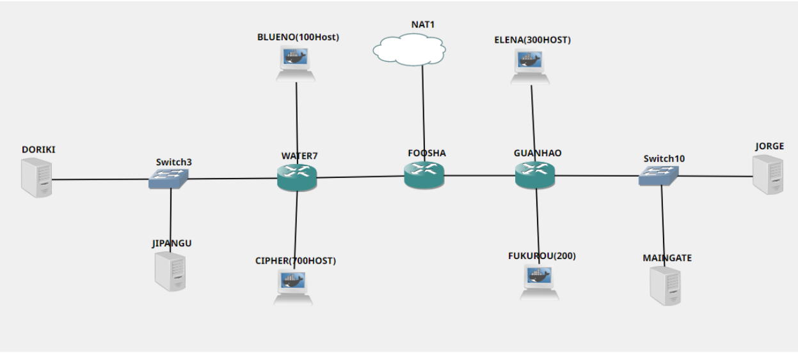
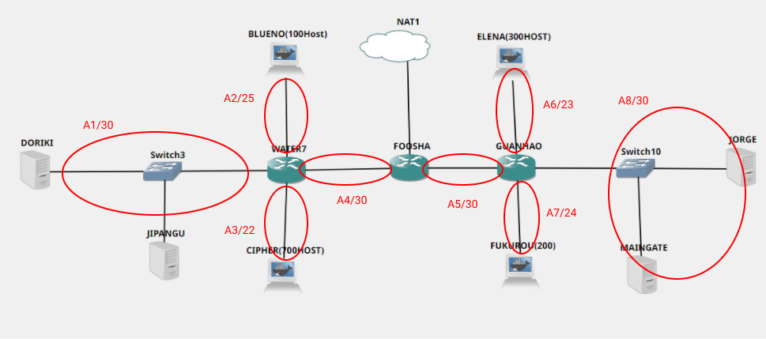
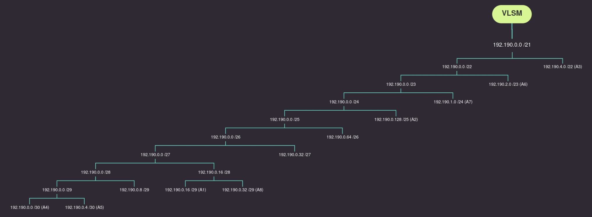
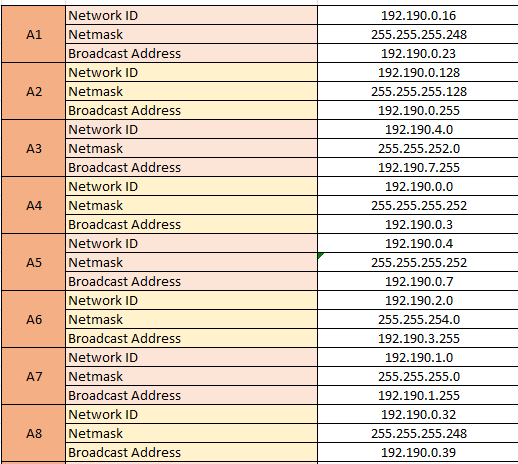
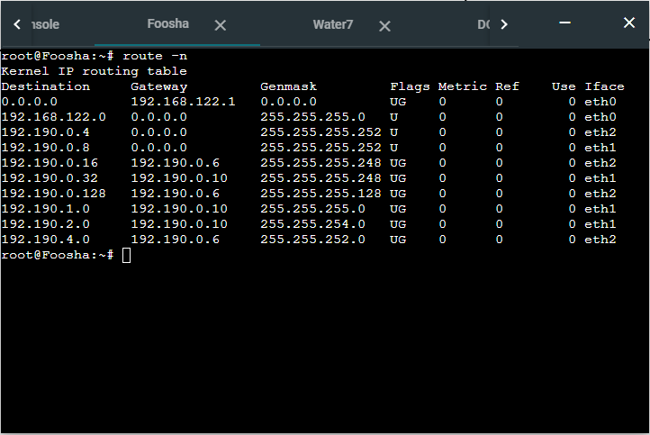
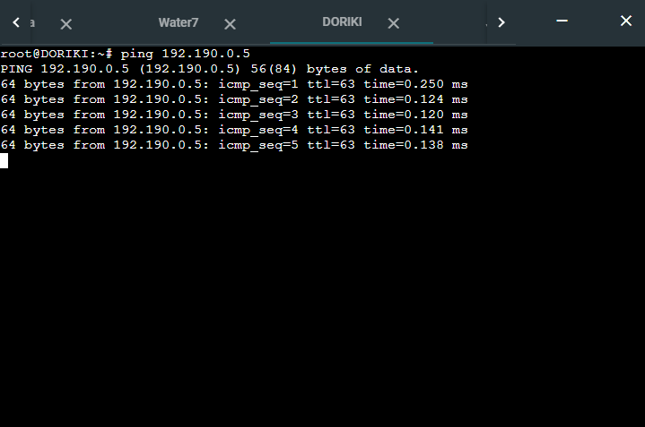

# Jarkom-Modul-5-C13-2021

## Anggota Kelompok :

| Anggota              | NRP            |
| -------------------- | -------------- |
| M. Auliya Mirzaq R.  | 05111940000065 |
| M. Akmal Joedhiawan  | 05111940000125 |
| M. Arsyad Ardiansyah | 05111940000228 |

## Soal

Setelah kalian mempelajari semua modul yang telah diberikan, Luffy ingin meminta bantuan untuk terakhir kalinya kepada kalian. Dan kalian dengan senang hati mau membantu Luffy.

**(A)**. Tugas pertama kalian yaitu membuat topologi jaringan sesuai dengan rancangan yang diberikan Luffy dibawah ini:



Keterangan :

- Doriki adalah DNS Server
- Jipangu adalah DHCP Server
- Maingate dan Jorge adalah Web Server
- Jumlah Host pada Blueno adalah 100 host
- Jumlah Host pada Cipher adalah 700 host
- Jumlah Host pada Elena adalah 300 host
- Jumlah Host pada Fukurou adalah 200 host

**(B)**. Karena kalian telah belajar subnetting dan routing, Luffy ingin meminta kalian untuk membuat topologi tersebut menggunakan teknik CIDR atau VLSM. setelah melakukan subnetting,
**(C)**. Kalian juga diharuskan melakukan Routing agar setiap perangkat pada jaringan tersebut dapat terhubung.
**(D)**. Tugas berikutnya adalah memberikan ip pada subnet Blueno, Cipher, Fukurou, dan Elena secara dinamis menggunakan bantuan DHCP server. Kemudian kalian ingat bahwa kalian harus setting DHCP Relay pada router yang menghubungkannya.

1. Agar topologi yang kalian buat dapat mengakses keluar, kalian diminta untuk mengkonfigurasi Foosha menggunakan iptables, tetapi Luffy tidak ingin menggunakan MASQUERADE.
2. Kalian diminta untuk mendrop semua akses HTTP dari luar Topologi kalian pada server yang merupakan DHCP Server dan DNS Server demi menjaga keamanan.
3. Karena kelompok kalian maksimal terdiri dari 3 orang. Luffy meminta kalian untuk membatasi DHCP dan DNS Server hanya boleh menerima maksimal 3 koneksi ICMP secara bersamaan menggunakan iptables, selebihnya didrop.

Kemudian kalian diminta untuk membatasi akses ke Doriki yang berasal dari subnet Blueno, Cipher, Elena dan Fukuro dengan beraturan sebagai berikut

4. Akses dari subnet Blueno dan Cipher hanya diperbolehkan pada pukul 07.00 - 15.00 pada hari Senin sampai Kamis.
5. Akses dari subnet Elena dan Fukuro hanya diperbolehkan pada pukul 15.01 hingga pukul 06.59 setiap harinya.
   Selain itu di reject
6. Karena kita memiliki 2 Web Server, Luffy ingin Guanhao disetting sehingga setiap request dari client yang mengakses DNS Server akan didistribusikan secara bergantian pada Jorge dan Maingate

Luffy berterima kasih pada kalian karena telah membantunya. Luffy juga mengingatkan agar semua aturan iptables harus disimpan pada sistem atau paling tidak kalian menyediakan script sebagai backup.

## Solusi

**(A)** Topologi yang sudah kami buat adalah sebagai berikut.



**(B)** Untuk pembagian IP pada toplogi di atas kami menggunakan VLSM

untuk pembagian IP akan dilakukan penghitungan kebutuhan IP untuk tiap subnet nya. Hasilnya dapat dilihat pada tabel di bawah :

| Subnet    | Jumlah IP | Netmask |
| --------- | --------- | ------- |
| A1        | 3         | /29     |
| A2        | 101       | /25     |
| A3        | 701       | /22     |
| A4        | 2         | /30     |
| A5        | 2         | /30     |
| A6        | 301       | /23     |
| A7        | 201       | /24     |
| A8        | 3         | /29     |
| **TOTAL** | **1314**  | **/21** |

Berdasarkan total IP dan netmask yang dibutuhkan, maka kita dapat menggunakan netmask /21 untuk memberikan pengalamatan pada subnet.

Setelah menghitung total IP yang dibutuhkan, subnet paling besar yang dibentuk memiliki NID 192.190.0.0 dan netmask /21. Dengan menggunakan NID dan netmask tersebut kita dapat menghitung pembagian alamat IP untuk tiap subnet pada gambar pohon pengalamatan dibawah.



Dari pohon tersebut akan mendapat pembagian alamt IP untuk setiap subnet sebagai berikut:



**(C)** Konfigurasi untuk routing dapat dilihat di bawah ini:

Tapi sebelum melakukan routing, harus terlebih dahulu untuk melakukan konfigurasi IP sesuai dengan yang dihitung sebelumnya

**Konfigurasi IP:**

**Router:**

- **Foosha**

  ```
  auto lo
  iface lo inet loopback

  auto eth0
  iface eth0 inet static
  address 192.168.122.46
  netmask 255.255.255.0
  gateway 192.168.122.1

  auto eth1
  iface eth1 inet static
  address 192.190.0.9
  netmask 255.255.255.252

  auto eth2
  iface eth2 inet static
  address 192.190.0.5
  netmask 255.255.255.252
  ```

- **Water7**

  ```
  auto lo
  iface lo inet loopback

  auto eth0
  iface eth0 inet static
  address 192.190.0.6
  netmask 255.255.255.252
  gateway 192.190.0.5

  auto eth1
  iface eth1 inet static
  address 192.190.0.17
  netmask 255.255.255.248

  auto eth2
  iface eth2 inet static
  address 192.190.0.129
  netmask 255.255.255.128

  auto eth3
  iface eth3 inet static
  address 192.190.4.1
  netmask 255.255.252.0
  ```

- **Guanhao**

  ```
  auto lo
  iface lo inet loopback

  auto eth0
  iface eth0 inet static
  address 192.190.0.10
  netmask 255.255.255.252
  gateway 192.190.0.9

  auto eth1
  iface eth1 inet static
  address 192.190.0.33
  netmask 255.255.255.248

  auto eth2
  iface eth2 inet static
  address 192.190.2.1
  netmask 255.255.254.0

  auto eth3
  iface eth3 inet static
  address 192.190.1.1
  netmask 255.255.255.0
  ```

**Server:**

- **Doriki**

  ```
  auto lo
  iface lo inet loopback

  auto eth0
  iface eth0 inet static
  address 192.190.0.18
  netmask 255.255.255.248
  gateway 192.190.0.17
  ```

- **Jipangu**

  ```
  auto lo
  iface lo inet loopback

  auto eth0
  iface eth0 inet static
  address 192.190.0.19
  netmask 255.255.255.248
  gateway 192.190.0.17
  ```

- **Maingate**

  ```
  auto lo
  iface lo inet loopback

  auto eth0
  iface eth0 inet static
  address 192.190.0.35
  netmask 255.255.255.248
  gateway 192.190.0.33
  ```

- **Jorge**

  ```
  auto lo
  iface lo inet loopback

  auto eth0
  iface eth0 inet static
  address 192.190.0.34
  netmask 255.255.255.248
  gateway 192.190.0.33
  ```

**Client:**

- **Blueno(100Host)**

  ```
  auto eth0
  iface eth0 inet dhcp
  ```

- **Chiper(700Host)**

  ```
  auto eth0
  iface eth0 inet dhcp
  ```

- **Elena(300Host)**

  ```
  auto eth0
  iface eth0 inet dhcp
  ```

- **Fukurou(200Host)**

  ```
  auto eth0
  iface eth0 inet dhcp
  ```

**Konfigurasi Routing:**

- **Foosha**

  ```
  route add -net 192.190.0.16 netmask 255.255.255.248 gw 192.190.0.6
  route add -net 192.190.0.128 netmask 255.255.255.128 gw 192.190.0.6
  route add -net 192.190.4.0 netmask 255.255.252.0 gw 192.190.0.6
  route add -net 192.190.2.0 netmask 255.255.254.0 gw 192.190.0.10
  route add -net 192.190.1.0 netmask 255.255.255.0 gw 192.190.0.10
  route add -net 192.190.0.32 netmask 255.255.255.248 gw 192.190.0.10
  ```

Lalu untuk mengecek apakah konfigurasi dari routing sebelumnya sudah berhasil dapat dicek menggunakan perintah :

```
route -n
```

Lalu jika berhasil akan tampil konfigurasi routing yang sudah diatur sebagai berikut:



Kita juga bisa cek koneksi antara perangkat dengan melakukan ping, misalnya dari `Doriki` ke `Foosha` sebagai berikut:



**(D)** Kemudian memberikan ip pada subnet Blueno, Cipher, Fukurou, dan Elena secara dinamis menggunakan bantuan DHCP server, untuk caranya bisa dilihat di bawah:
